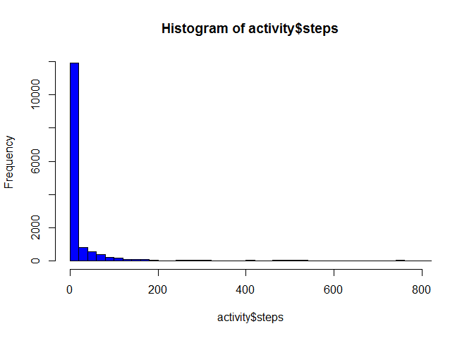

# Reprd_Resrc_PA_1_Report
Arrart Kongtaln  
Sunday, January 18, 2015  


## Loading and preprocessing the data

```r
activity <- read.csv("activity.csv",na.strings=c("NA",""))
##dim(activity)
##17568
##summary(activity)
```

## What is mean total number of steps taken per day?

```r
hist(activity$steps, breaks=50, col='blue')
```

 

```r
steps <- c(activity$steps)
mean(steps, na.rm = TRUE)
```

[1] 37.3826

```r
##ls_1 <- c(1,0,4,4,5,8,0,NA)
##median(ls_1, na.rm = TRUE)
median(steps, na.rm = TRUE)
```

[1] 0


## What is the average daily activity pattern?


## Imputing missing values


## Are there differences in activity patterns between weekdays and weekends?
